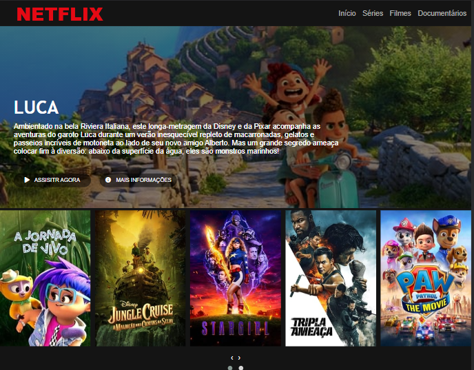

# Recriando a interface da Netflix.
 
 Desenvolvimento do projeto com **HTML5**, **CSS3** e **JavaScript**. 

 No projeto, utilizei o border-radius com 50px para deixar os botões **_ASSISTIR AGORA_** e **_MAIS INFORMAÇÕES_** arredondados.

 Adicionei a função clicou() no botão **_ASSISTIR AGORA_** que abre uma nova aba com o site da Netflix.

  

 
 
 
